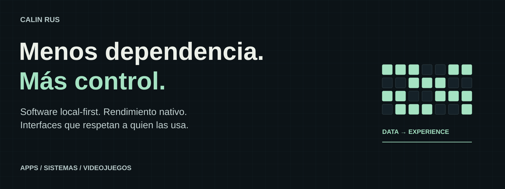

# Soy Calin Rus

Desarrollo **aplicaciones de escritorio y móvil, herramientas, sistemas y videojuegos**. Me gusta convertir problemas concretos en software que se pueda entender, controlar y seguir mejorando.

Mi forma de construir combina **mentalidad data-driven, arquitectura orientada a datos y filosofía local-first**. Busco rendimiento nativo, autonomía y una experiencia sobria: información útil a mano, pocos pasos innecesarios y decisiones de diseño que respeten a quien usa la aplicación.

[**Portfolio y demostraciones →**](https://github.com/calinrus-dev/portfolio) · [calinrus.com](https://calinrus.com) · [Instagram @c4linrus](https://www.instagram.com/c4linrus/)

## Datos, ciclos y rendimiento

Para mí, optimizar empieza por entender qué ocurre: definir una carga, medir el comportamiento y comparar los cambios. Me interesan tanto los tiempos de respuesta como el consumo de memoria y el trabajo que puede evitarse.

En sistemas nativos pienso en **disposición de datos, estructuras contiguas, localidad de memoria y alineación con las líneas de caché cuando la medición lo justifica**. Cuidar copias, asignaciones y recorridos repetidos forma parte de esa mentalidad. Mis conocimientos de **Assembly** me ayudan a relacionar las abstracciones con la ejecución de la máquina.

## Local-first y autonomía

Prefiero que una aplicación conserve una experiencia útil en el dispositivo, con datos y recursos bajo control. La persistencia local, la continuidad del trabajo y la posibilidad de exportar importan tanto como la interfaz.

Cada base de datos externa, servicio o dependencia añade decisiones y costes. Los incorporo cuando tienen una función clara y procuro reducir las dependencias que no aportan valor. El alcance depende del producto: colaboración, distribución o sincronización pueden necesitar servicios remotos.

## Interfaces sobrias, densas y accesibles

En escritorio me gustan las interfaces con **densidad de información útil**: comparar, encontrar y actuar sin recorrer pantallas innecesarias. Esa densidad necesita jerarquía, contraste, texto legible y navegación rápida.

En móvil adapto el recorrido al espacio, al tacto y al contexto. Me interesa el **diseño minimalista y responsivo** que quita ruido y conserva las señales necesarias para entender qué está pasando.

La **accesibilidad visual es una prioridad personal**. Contraste, escalado, foco visible, teclado, movimiento reducido y estados que no dependan solo del color son criterios de producto. También se aplican a editores y videojuegos. Su funcionamiento con tecnologías de asistencia requiere pruebas específicas.

## Stack y áreas de conocimiento

- **Sistemas y escritorio:** Rust, Tauri, Python, Textual y PyQt.
- **Aplicaciones multiplataforma:** Flutter, Dart, React Native, Expo y TypeScript.
- **Web:** React, Next.js, TypeScript y diseño responsivo.
- **Videojuegos y gráficos:** Godot, GDScript, Bevy, Rust y WebGL.
- **Datos y bajo nivel:** SQLite, PostgreSQL, arquitectura orientada a datos y conocimientos de Assembly.
- **Diseño:** interfaces sobrias, jerarquía visual, densidad de información, minimalismo y accesibilidad.

Godot está presente en Etherune; Bevy forma parte de mis áreas de trabajo y exploración. El estado de cada proyecto indica qué se ha construido y qué se ha verificado.

[Filosofía de desarrollo](docs/FILOSOFIA.md) · [Stack explicado por áreas](docs/STACK.md)

## Aplicaciones, sistemas y videojuegos

- [**Etherune**](https://github.com/calinrus-dev/etherune-showcase) — combate elemental, portadores, arena local y creación de escenarios en Godot.
- [**Atelier 3D**](https://github.com/calinrus-dev/atelier-3d-showcase) — edición espacial, materiales y recorridos de presentación con Tauri, Rust y WebGL.
- [**Malphas**](https://github.com/calinrus-dev/malphas-showcase) — motor nativo y herramientas visuales con Rust, Flutter y Dart.
- [**Nhur**](https://github.com/calinrus-dev/nhur-showcase) — Entornos, Canales, Máscaras e identidad contextual.
- [**KanjiZen**](https://github.com/calinrus-dev/kanjizen-showcase) — entrenamiento de kana con MECA, Flick y progreso local.
- [**Caja Clara**](https://github.com/calinrus-dev/caja-clara-showcase) — jornada, inventario, calendario e informes desde el móvil.

## Herramientas y exploraciones

- [**Morgenstern**](https://github.com/calinrus-dev/morgenstern-showcase) — organización de proyectos narrativos, borradores y revisión editorial.
- [**ModelLedger**](https://github.com/calinrus-dev/modelledger-showcase) — investigación de modelos y planes de IA con evidencia e histórico; integración en desarrollo.
- [**BarrientosCare**](https://github.com/calinrus-dev/barrientoscare-showcase) — catálogo, selección de productos y gestión comercial.
- [**ECB Tool**](https://github.com/calinrus-dev/ecb-tool-showcase) — recursos musicales, conversión audiovisual y colas de publicación.
- [**Glow**](https://github.com/calinrus-dev/glow-showcase) — exploración histórica de espacios sociales e identidad contextual.
- [**Glow Design**](https://github.com/calinrus-dev/glow-design-showcase) — investigación de componentes, temas y movimiento en Flutter y Dart.

## Qué comparto aquí

Los casos de estudio reúnen documentación, componentes, decisiones de diseño, diagramas y material visual. Cada uno declara su estado y diferencia capturas reales de ilustraciones. La implementación de los productos, sus integraciones internas y sus datos permanecen en repositorios privados.

La actividad del perfil puede incluir mantenimiento automatizado; no representa necesariamente trabajo manual diario.
